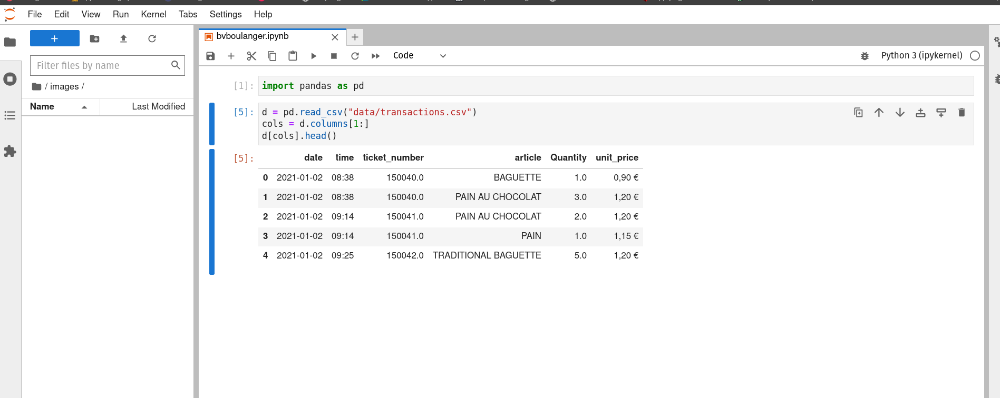

# Bienvenue
Guide pour faire avancer les choses avec les copins

Il s'agit d'un dépôt de test pour initier les collborateurs à l'utilisation de git et conda. Il est donc préférable de se familiariser ET INSTALLER l'ensemble d'outils permettant de faire de la science des données et de collaborer à des projets de programmation. Cela peut se résumer en deux étapes :
1. Le contrôle de version
2. Environnements virtuels

## Contrôle de version et collaboration
C'est ainsi que nous partageons le travail, enregistrer les modifications apportées au code (qui et quoi) et discutons des questions concernant le code en cours de développement. Il est préférable de lire la première section. Ne vous inquiétez pas si vous vous sentez dépassé, il s'agit d'un outil puissant qui est en développement depuis des décennies. Notre objectif n'est pas de devenir des experts (du moins pas en un jour).

1. [Git](https://git-scm.com/book/fr/v2)
   1. [Démarrage rapide](https://git-scm.com/book/fr/v2/D%C3%A9marrage-rapide-%C3%80-propos-de-la-gestion-de-version)
   2. [Installation](https://git-scm.com/book/fr/v2/D%C3%A9marrage-rapide-Installation-de-Git)
      1. Pour Windows, lors de l'installation de Git par le biais du programme d'installation, il est recommandé de sélectionner l'option *Use Git from Windows Command Prompt*
   3. [Parametrage](https://git-scm.com/book/fr/v2/D%C3%A9marrage-rapide-Param%C3%A9trage-%C3%A0-la-premi%C3%A8re-utilisation-de-Git)

   
*Une fois que vous avez installé git, créez un compte sur GitHub.*

[GitHub](https://github.com/)

## L'environnement virtuel
Un environnement virtuel est un outil pour garder les dépendances requises par différents projets dans des emplacements séparés, en créant des environnements virtuels Python pour eux. Il résout le dilemme “le projet X dépend de la version 1.x mais le projet Y nécessite la 4.x”, et garde votre répertoire site-packages global propre et gérable. L'environnement virtuel vous permet d'utiliser de nombreux outils différents sans modifier le système d'exploitation de votre machine locale. C'est la boîte à outils. C'est ainsi que nous spécifions ce qui est précisément nécessaire pour exécuter le code sur lequel nous travaillons.

1. [Explication des environnements virtuels](https://www.pythoniste.fr/anaconda/les-environnements-virtuels-en-python-avec-anaconda/)
2. [Annaconda](https://www.anaconda.com/)
3. [Annaconda Installers](https://www.anaconda.com/products/distribution#Downloads)
   1. N'installez pas *data spell* sauf si vous avez absolument besoin d'un IDE, si vous ne savez pas ce qu'est un IDE vous n'en avez probablement pas besoin.

Ceci conclut l'installation des outils de base. Toute méthode ou module dont nous avons besoin pour accomplir une tâche de programmation est inclus dans Anaconda.

## Faites une copie de ce dépôt (git clone)

C'est ainsi que vous obtenez la version actuelle du projet sur votre ordinateur. Elle comprend toutes les données et les spécifications des modules nécessaires à l'exécution du notebook dans ce repo.

### Cloner un dépôt existant [ref](https://git-scm.com/book/fr/v2/Les-bases-de-Git-D%C3%A9marrer-un-d%C3%A9p%C3%B4t-Git) 


Créez un dossier appelé simple_projects. Ce dossier doit se trouver sous le répertoire principal de l'utilisateur. Dans Windows, cela ressemble à ceci :

```bash
C:/Users/user/simple_project
```

En utilisant le Windows Power Shell, naviguez dans le répertoire simple_project nouvellement créé :

```bash
cd C:/Users/user/simple_project
```

Clonez (faites une copie) de ce projet dans le répertoire simple_project :

```bash
git clone https://github.com/hammerdirt-dev/bienvenue
```

Ceci crée un répertoire nommé bienvenue, initialise un répertoire .git à l’intérieur, récupère toutes les données de ce dépôt, et extrait une copie de travail de la dernière version. Si vous examinez le nouveau répertoire bienvenue, vous y verrez les fichiers du projet, prêts à être modifiés ou utilisés.

## Utiliser l'environnement virtuel spécifié dans ce dépôt

Dans ce dépôt, il y a un fichier appelé environment.yml. Il contient les outils nécessaires pour exécuter le code dans cet environnement. Si vous êtes sous Windows, utilisez l'invite Anaconda et naviguez jusqu'au:
```bash
cd C:/Users/user/simple_project
```
Maintenant, créez et activez le nouvel environnement avec la commande suivante:
```bash
conda env create -f environment.yml
conda activate bienvenue
conda env list
```
Cela produira une liste de tous les paquets et modules qui sont nécessaires (et installés) pour travailler dans ce simple projet.

## Using jupyter [ref](https://jupyter.org/)
Jupyter est le moyen et l'endroit où nous développons des modèles, faisons de l'exploration de données et créons des documents finis. Maintenant que tout est installé et que l'environnement virtuel est activé, tapez simplement (à partir de Anaconda Prompt) :

```bash
jupyter lab
```
Cela devrait lancer un navigateur web et l'interface jupyter.

### Success


